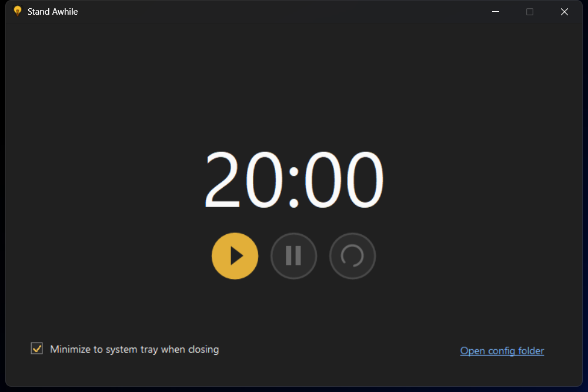

# Stand Awhile (Chinese name: 站一站)


**StandAwhile** (Chinese name: 站一站) is a lightweight Windows desktop utility that gently reminds you to stand up, stretch, and move every 20 minutes.

> “Stand awhile, breathe, and stretch.”

Designed to be unobtrusive and minimal, it helps reduce the health risks of prolonged sitting without interrupting your workflow.

---

## ✨ Features

- ⏱ **Smart Timer**: Default 20-minute interval (fully configurable)
- 🔕 **Gentle Notifications**: Flash the window when visible, or show a Windows toast notification when minimized to tray
- 🪶 **Lightweight**: Runs quietly in the system tray with minimal memory usage
- 🛠 **Customizable**:
  - Adjust reminder intervals
  - Customize reminder messages
  - Skip or snooze reminders
- 🖥 **Native Experience**: Pure Windows application, no browser dependencies

---

## 📸 Screenshot



---

## 🚀 Getting Started

### Download & Run
1. Go to the [Releases](https://github.com/yin-hai-bo/stand-awhile/releases) page
2. Download the latest `StandAwhile.zip`
3. Extract and run `StandAwhile.exe`
4. The app will minimize to the system tray

Note: Windows toast notifications can be suppressed by system settings such as Do Not Disturb / Focus Assist.

### Build from Source

Prerequisites:

- Windows 10 or later
- Rust toolchain installed via [rustup](https://rustup.rs/)
- Microsoft C++ Build Tools, installed through Visual Studio Build Tools or Visual Studio

Clone and build:

```powershell
git clone https://github.com/yin-hai-bo/stand-awhile.git
cd stand-awhile
cargo build --release
```

Run from source:

```powershell
cargo run
```

The release executable will be generated at:

```text
target/release/stand-awhile.exe
```

For development checks, run:

```powershell
cargo fmt
cargo test
```
