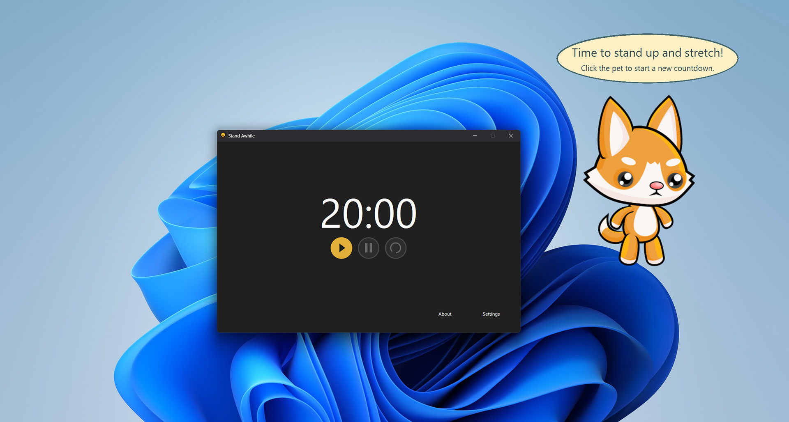
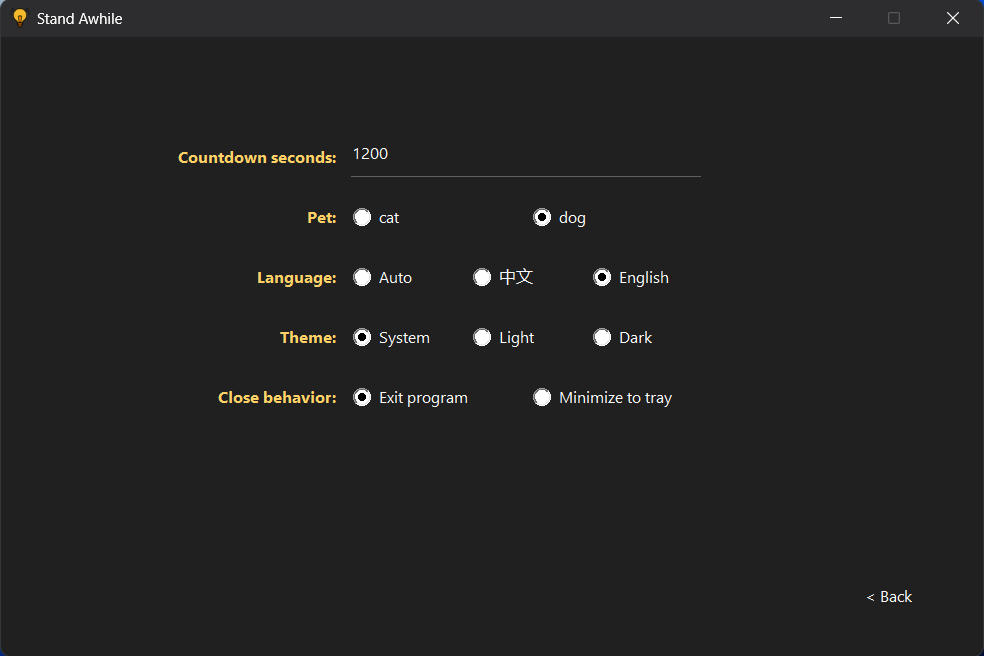

# Stand Awhile (Chinese name: 站一站)


**StandAwhile** (Chinese name: 站一站) is a lightweight Windows desktop utility that gently reminds you to stand up, stretch, and move every 20 minutes.

> “Stand awhile, breathe, and stretch.”

It reminds you to take a movement break without taking focus away from your work.

---

## ✨ Features

- ⏱ **Smart Timer**: Default 20-minute interval (fully configurable)
- 🐾 **Desktop Pet Reminders**: Show a transparent animated Pet when the timer completes
- 🪶 **Tray Controls**: Start the timer, show the main window, open Settings or About, and exit
- 🛠 **Customizable**:
  - Adjust reminder intervals
  - Choose the Pet character (`cat` or `dog`)
  - Choose the application language and theme
  - Choose whether closing the main window exits or hides it to the tray
- 🖥 **Native Experience**: Pure Windows application, no browser dependencies

---

## 📸 Screenshot





---

## 🚀 Getting Started

### Download & Run
1. Go to the [Releases](https://github.com/yin-hai-bo/stand-awhile/releases) page
2. Download the executable (extract it first if distributed in an archive)
3. Run `stand-awhile.exe`
4. The main window and Pet appear; click Play or the Pet to start the countdown

The executable includes the Cat and Dog images and animation manifest. You can
distribute the EXE alone; no external `assets` folder is required at runtime.

The Pet is the application's reminder channel. It can be dragged, clicked to
acknowledge a reminder, or controlled through its context menu. The application
does not use Windows toast notifications or tray balloon reminders.

Click the Pet to hide it and start a new countdown. Its speech bubble shows a
fixed reminder and this click instruction in the selected application language
(Chinese or English). Bubble text and timing are built in; the former
`speech_bubble` configuration is ignored and removed when configuration is saved.
The Pet starts with its Walk animation, switches to Idle while the bubble is
visible, and returns to Walk when the bubble disappears.
When a countdown ends, the Pet flies in from the nearest top or bottom screen
edge with Jump, then switches to Walk before the bubble cycle starts.

On the first countdown start of each app session, clicking the Pet or choosing
**Start** from either the Pet or tray menu also hides the main window to the
tray. Starting with the main window's Play button keeps the window visible.
Later starts do not automatically hide it, including after pause or reset.
This behavior is independent of the close-to-tray setting.

Pause stops the countdown and hides the Pet. Reset restores the configured
interval, stops the countdown, and brings the Pet back with Jump. Closing the main window
exits by default. Enable **Minimize to tray** in Settings to hide only the main
window; the countdown and any visible Pet reminder continue.

### Settings and Configuration

Open **Settings** from the main window, tray menu, or Pet menu. Character,
language, theme, and close behavior changes are saved and applied immediately.
The interval is measured in seconds (at least 1 in Settings) and is saved when
you click **Back**. Changing the interval replaces the remaining countdown;
changing other settings preserves it.

The UTF-8 configuration file is `%APPDATA%\yhb\stand-awhile\config.json`.
It is created on first launch. For manual changes, close the application, edit
the file, then restart. Omitted or null fields use the defaults below.

| Field | Default | Values / behavior |
| --- | --- | --- |
| `period` | `1200` | Countdown interval in seconds |
| `character` | `"cat"` | `"cat"` or `"dog"`; unknown characters fall back to Cat |
| `language` | `"auto"` | `"auto"`, `"zh"`, or `"en"`; Auto follows the Windows UI language, using Chinese for Chinese locales and English otherwise |
| `theme` | `"system"` | `"system"`, `"light"`, or `"dark"` |
| `tray_when_close` | `false` | `true` hides the main window on close; `false` exits |
| `pet_position` | `null` | Position saved automatically after dragging |

### Build from Source

Prerequisites:

- Windows 10 or later
- Rust toolchain installed via [rustup](https://rustup.rs/)
- Microsoft C++ Build Tools, installed through Visual Studio Build Tools or Visual Studio

Clone and build:

```powershell
git clone https://github.com/yin-hai-bo/stand-awhile.git
cd stand-awhile
cargo build --release
```

Run from source:

```powershell
cargo run
```

The release executable will be generated at:

```text
target/release/stand-awhile.exe
```

Release builds require a clean Git working tree. For development with local
changes, use `cargo build` or `cargo run`. Image and manifest changes require a
rebuild because they are embedded in the executable.

For development checks, run:

```powershell
cargo fmt -- --check
cargo test
cargo build
```

See [Pet verification](docs/desktop-pet-verification.md) for Windows smoke checks
and [Project context](CONTEXT.md) for the implementation's module boundaries.
