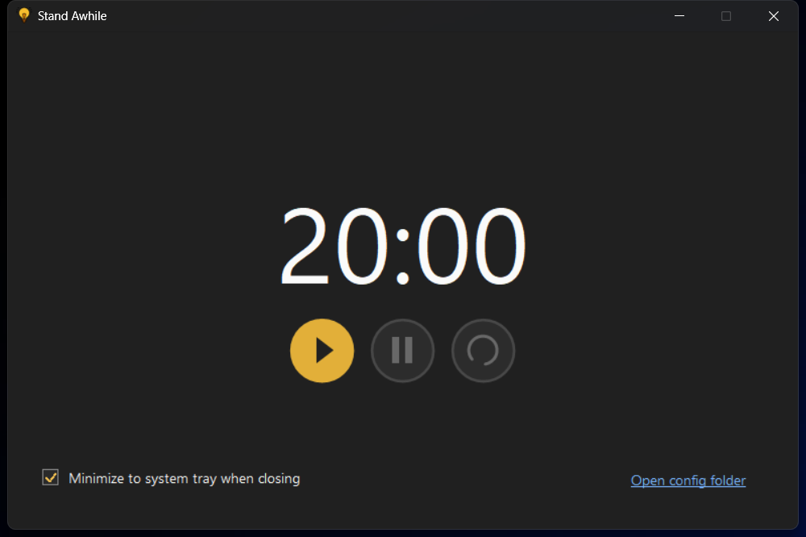

# Stand Awhile (Chinese name: 站一站)


**StandAwhile** (Chinese name: 站一站) is a lightweight Windows desktop utility that gently reminds you to stand up, stretch, and move every 20 minutes.

> “Stand awhile, breathe, and stretch.”

Designed to be unobtrusive and minimal, it helps reduce the health risks of prolonged sitting without interrupting your workflow.

---

## ✨ Features

- ⏱ **Smart Timer**: Default 20-minute interval (fully configurable)
- 🐾 **Desktop Pet Reminders**: Show a transparent animated Pet when the timer completes
- 🪶 **Lightweight**: Runs quietly in the system tray with minimal memory usage
- 🛠 **Customizable**:
  - Adjust reminder intervals
  - Choose the Pet character (`cat` or `dog`) in the configuration file
  - Choose the application language and theme
- 🖥 **Native Experience**: Pure Windows application, no browser dependencies

---

## 📸 Screenshot



---

## 🚀 Getting Started

### Download & Run
1. Go to the [Releases](https://github.com/yin-hai-bo/stand-awhile/releases) page
2. Download the latest `StandAwhile.zip`
3. Extract and run `StandAwhile.exe`
4. The app will minimize to the system tray

The executable includes the Cat and Dog images and animation manifest. You can
distribute the EXE alone; no external `assets` folder is required at runtime.

The Pet is the application's reminder channel. It can be dragged, clicked to
acknowledge a reminder, or controlled through its context menu. The application
does not use Windows toast notifications or tray balloon reminders.

Click the Pet to hide it and start a new countdown. Its speech bubble shows a
fixed reminder and this click instruction in the selected application language
(Chinese or English). Bubble text and timing are built in; the former
`speech_bubble` configuration is ignored and removed when configuration is saved.
The Pet starts with its Walk animation, switches to Idle while the bubble is
visible, and returns to Walk when the bubble disappears.
When a countdown ends, the Pet flies in from the nearest top or bottom screen
edge with Jump, then switches to Walk before the bubble cycle starts.

The configuration file is available from the application's **Open config folder**
link or tray menu. Set `"character": "dog"` to use the Dog Pet; the default is
`"cat"`.

### Build from Source

Prerequisites:

- Windows 10 or later
- Rust toolchain installed via [rustup](https://rustup.rs/)
- Microsoft C++ Build Tools, installed through Visual Studio Build Tools or Visual Studio

Clone and build:

```powershell
git clone https://github.com/yin-hai-bo/stand-awhile.git
cd stand-awhile
cargo build --release
```

Run from source:

```powershell
cargo run
```

The release executable will be generated at:

```text
target/release/stand-awhile.exe
```

For development checks, run:

```powershell
cargo fmt
cargo test
```
